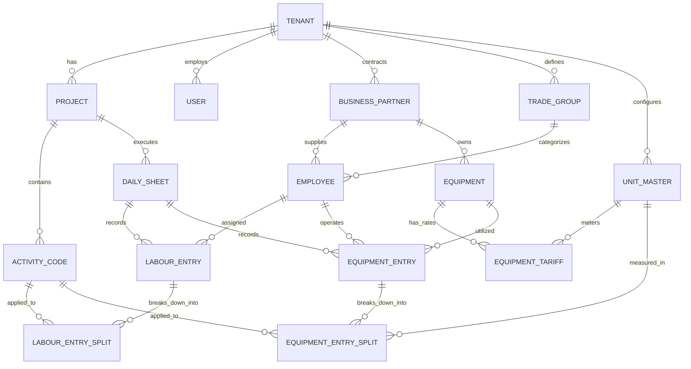

# Database Normalization Analysis & 3NF Redesign Plan
**Project:** Mäga Construction ERP (Labour & Machinery Management System)  
**Author / Evaluator:** Antigravity AI Pair Programmer  
**Target:** 1st, 2nd, and 3rd Normal Form (3NF) Compliance  

---

## 1. Executive Summary: Why Your Boss Asked for Normalization

When reviewing enterprise databases (especially in ERP environments like SAP, IFS, or Oracle), technical leads and database architects look for **Data Integrity**, **Zero Redundancy**, and adherence to **Relational Database Normal Forms (1NF, 2NF, 3NF)**.

In the current [`schema.prisma`](file:///g:/Maga-Frontend/backend/prisma/schema.prisma), several structural issues cause **update anomalies**, **redundant storage**, and **inconsistent foreign key constraints**:

```
Current Architecture (Flawed)              Normalized 3NF Architecture
┌───────────────────────────────┐          ┌──────────────────────────────┐
│ Corporate Tables (Duplicate)  │          │ Unified Master Entities      │
│  - CorporateEmployee          │          │  - Single Employee Model     │
│  - CorporateEquipment         │   ───►   │  - Single Equipment Model    │
│  - CorporateBusinessPartner   │          │  - Central Organization/Site │
│  - CorporateActivityCode      │          └──────────────┬───────────────┘
└──────────────┬────────────────┘                         │ (FK Relations)
               │ (No FKs, Raw Strings)                    ▼
┌──────────────▼────────────────┐          ┌──────────────────────────────┐
│ Tenant / Operational Tables   │          │ Strict Relational Integrity  │
│  - Raw arrays (availableUnits)│          │  - 1NF: Atomic values only   │
│  - Split vs Header duplicates │          │  - 2NF: No partial deps      │
│  - Redundant Names & Codes    │          │  - 3NF: No transitive deps   │
└───────────────────────────────┘          └──────────────────────────────┘
```

---

## 2. Detailed Normalization Violations in Current Schema

### 2.1 First Normal Form (1NF) Violations
> **1NF Requirement:** Every column must hold atomic (indivisible) values, and there must be no repeating groups or array attributes.

* **Violation 1: Array Columns (`availableUnits String[]`)**
  - **Location:** [`model Equipment`](file:///g:/Maga-Frontend/backend/prisma/schema.prisma#L190) and [`model CorporateEquipment`](file:///g:/Maga-Frontend/backend/prisma/schema.prisma#L561)
  - **Issue:** `availableUnits String[]` stores a Postgres array (`["mth", "km", "hrs"]`).
  - **Why it violates 1NF:** Relational databases require discrete rows rather than serialized arrays. Filtering or joining against elements inside an array column requires custom non-relational functions (`unnest`, array operators) and cannot be indexed via standard B-Tree FK indexes.
  - **Fix:** Units and tariffs should exist solely in the child relation [`model EquipmentUnitRate`](file:///g:/Maga-Frontend/backend/prisma/schema.prisma#L212).

---

### 2.2 Second Normal Form (2NF) Violations
> **2NF Requirement:** The table must be in 1NF, and all non-key attributes must depend fully on the primary key (no partial dependencies).

* **Violation 2: Parallel Redundant Assignment Tables**
  - **Location:** [`DailyAssignment`](file:///g:/Maga-Frontend/backend/prisma/schema.prisma#L317), [`DailyOperatorAssignment`](file:///g:/Maga-Frontend/backend/prisma/schema.prisma#L399), [`DailyEquipmentAssignment`](file:///g:/Maga-Frontend/backend/prisma/schema.prisma#L445)
  - **Issue:** Three separate tables replicate the identical schema structure (`dailySheetId`, `date`, `supervisorId`, `tenantId`) with only the assigned resource foreign key (`employeeId`, `operatorId`, `equipmentId`) differing.
  - **Why it violates 2NF:** Operators are technically employees (`Employee.isOperator = true`). Having separate daily assignment structures creates separate duplicate dependency trees for the exact same supervisor shift sheet.

---

### 2.3 Third Normal Form (3NF) Violations
> **3NF Requirement:** The table must be in 2NF, and no non-key attribute may depend transitively on the primary key (X → Y, Y → Z where X is PK). No non-prime attribute should determine another non-prime attribute.

* **Violation 3: Duplicate Text Attributes Alongside Foreign Keys**
  - **Location:** [`model Employee`](file:///g:/Maga-Frontend/backend/prisma/schema.prisma#L151-L152)
    ```prisma
    tradeGroup   String?  @map("trade_group")    // Raw string: "Mason"
    tradeGroupId String?  @map("trade_group_id") // Foreign key to TradeGroup
    ```
  - **Why it violates 3NF:** `Employee.id -> tradeGroupId -> tradeGroup.name`. Storing both creates a transitive dependency. If someone renames the trade in `TradeGroup`, the string in `Employee` becomes out of sync (**Update Anomaly**).
  
* **Violation 4: Denormalized Partner Details in Corporate Tables**
  - **Location:** [`model CorporateEmployee`](file:///g:/Maga-Frontend/backend/prisma/schema.prisma#L583-L584)
    ```prisma
    businessPartnerCode String? @map("business_partner_code")
    businessPartnerName String? @map("business_partner_name")
    ```
  - **Why it violates 3NF:** `businessPartnerName` is functionally dependent on `businessPartnerCode`, neither of which is a foreign key to `CorporateBusinessPartner`. If a contractor changes their legal name, you must update thousands of rows in `CorporateEmployee` rather than a single row in the partner table.

* **Violation 5: Unnormalized Project/Site Code Strings**
  - **Location:** Found in `DailySheet.siteCode`, `ActivityCode.projectCode`, `CorporateEmployee.currentWorkingProject`, and `CorporateEquipment.currentWorkingProject`.
  - **Why it violates 3NF:** There is a [`CorporateProject`](file:///g:/Maga-Frontend/backend/prisma/schema.prisma#L626) table, yet none of these operational models link to it via a Foreign Key! They all store freeform strings. A typo like `"CPC-PKG-02"` vs `"CPC PKG 2"` corrupts aggregation reports.

* **Violation 6: Header vs Split Redundancy in Logs**
  - **Location:** [`EquipmentDailyLog`](file:///g:/Maga-Frontend/backend/prisma/schema.prisma#L496) has `activityCodeId String?`, while also having a 1-to-Many relation [`activities EquipmentDailyLogActivity[]`](file:///g:/Maga-Frontend/backend/prisma/schema.prisma#L518).
  - **Location:** [`TimeEntry`](file:///g:/Maga-Frontend/backend/prisma/schema.prisma#L346) has `activityId String`, while also having [`activitySplits LaborActivitySplit[]`](file:///g:/Maga-Frontend/backend/prisma/schema.prisma#L379).
  - **Why it violates 3NF:** If an entry has a split of 4 hours on Activity A and 4 hours on Activity B, what does the header's `activityId` mean? It creates ambiguity and double-counting risks in SQL `SUM()` queries.

---

### 2.4 Duplicate Table Architecture (Corporate vs Tenant Tables)
In the current schema, there is a parallel universe of tables:
- `Employee` ⟷ `CorporateEmployee`
- `Equipment` ⟷ `CorporateEquipment`
- `BusinessPartner` ⟷ `CorporateBusinessPartner`
- `ActivityCode` ⟷ `CorporateActivityCode`

This design originated because site-level data was separated from central ERP catalog data. However, in an enterprise relational model:
1. **Single Source of Truth:** A machine (`MCBW0002`) or an employee (`R8184`) should have **one primary record**.
2. **Site Assignment:** Allocation to a project or site should be handled via a **Project/Site Assignment relation** (e.g. `EquipmentAssignment`, `EmployeeSiteAllocation`), not by duplicating the entire table!

---

## 3. Entity-by-Entity Comparison: Before vs Normalized

| Entity / Concept | Current Schema (Unnormalized) | Normalized 3NF Schema |
|---|---|---|
| **Projects / Sites** | Loose string `site_code` / `project_code` scattered across 5 tables; disconnected `CorporateProject` | Central `Project` model with `id`, `code`, `name`. Referenced by FK in Daily Sheets, Equipment Allocations, and Activity Codes. |
| **Business Partners** | Separated into `BusinessPartner` and `CorporateBusinessPartner`; plain string names copied to employee tables | Single `BusinessPartner` table. Referenced strictly by `businessPartnerId` FK. |
| **Trades / Categories** | String `trade_group` AND foreign key `trade_group_id` coexisting in Employee | Single `TradeGroup` table. Employee has only `tradeGroupId` FK. |
| **Equipment & Tariffs** | Array `availableUnits String[]` (1NF violation) and duplicated `CorporateEquipment` | Single `Equipment` master. Units, billing codes (`XQ0002932A`), and rates live strictly in `EquipmentTariff` (1NF atomic). |
| **Assignments** | 3 separate tables: `DailyAssignment`, `DailyOperatorAssignment`, `DailyEquipmentAssignment` | Unified `DailyResourceAssignment` polymorphic or clean 2-table model (Labour/Operator Assignment & Equipment Assignment). |
| **Activity Logging** | Dual activity tracking (Activity on Header AND Activity in Split child table) | Header contains Daily Sheet context (Date, Site, Supervisor). Activity details & hours live **exclusively** in the Activity Splits table. |
| **Units of Measure** | Loose strings `"hrs"`, `"mth"`, `"day"` hardcoded alongside `UnitMaster` | Strict relation to `UnitMaster` (`unitId`), guaranteeing standard IFS/SAP unit codes. |

---

## 4. Proposed Normalized 3NF ER Architecture

### 4.1 Mermaid Entity-Relationship Diagram



---

## 5. Normalized 3NF Schema Specification (Prisma Blueprint)

Here is how the normalized entities should be structured:

```prisma
// 1. PROJECTS & SITES (Normalized)
model Project {
  id             String         @id @default(uuid())
  tenantId       String         @map("tenant_id")
  code           String         // e.g. "M00000531", "CPC-PKG-02"
  name           String         // e.g. "Central Expressway Package 2"
  status         String         @default("active") // "active" | "completed" | "suspended"
  createdAt      DateTime       @default(now()) @map("created_at")

  tenant         Tenant         @relation(fields: [tenantId], references: [id], onDelete: Cascade)
  activityCodes  ActivityCode[]
  dailySheets    DailySheet[]

  @@unique([tenantId, code])
  @@map("projects")
}

// 2. BUSINESS PARTNERS (Unified Master)
model BusinessPartner {
  id            String      @id @default(uuid())
  tenantId      String      @map("tenant_id")
  code          String      // e.g. "BP1002885"
  name          String      // e.g. "Mäga Engineering (Pvt) Ltd"
  type          String      // "internal" | "subcontractor" | "supplier"
  contactPerson String?     @map("contact_person")
  phone         String?
  address       String?
  status        String      @default("active")
  createdAt     DateTime    @default(now()) @map("created_at")

  tenant        Tenant      @relation(fields: [tenantId], references: [id], onDelete: Cascade)
  employees     Employee[]
  equipment     Equipment[]

  @@unique([tenantId, code])
  @@map("business_partners")
}

// 3. TRADE GROUPS (Normalized Categories)
model TradeGroup {
  id                String     @id @default(uuid())
  tenantId          String     @map("tenant_id")
  code              String     // e.g. "TRD-MAS", "TRD-OP"
  name              String     // "Mason", "Carpenter", "Operator", "Driver"
  standardDailyRate Decimal    @map("standard_daily_rate") @db.Decimal(10, 2)
  standardOtRate    Decimal?   @map("standard_ot_rate") @db.Decimal(10, 2)

  tenant            Tenant     @relation(fields: [tenantId], references: [id], onDelete: Cascade)
  employees         Employee[]

  @@unique([tenantId, code])
  @@map("trade_groups")
}

// 4. EMPLOYEES & OPERATORS (Unified Master - 3NF Clean)
model Employee {
  id                String          @id @default(uuid())
  tenantId          String          @map("tenant_id")
  employeeCode      String          @map("employee_code") // e.g. "R8184", "HK362"
  callingName       String          @map("calling_name")
  fullName          String          @map("full_name")
  nicNo             String?         @map("nic_no")
  epfNo             String?         @map("epf_no")
  dailyRate         Decimal         @map("daily_rate") @db.Decimal(10, 2)
  isOperator        Boolean         @default(false) @map("is_operator")
  licenseNo         String?         @map("license_no")
  status            String          @default("active")
  
  // Normalized Foreign Keys (No raw redundant text columns)
  tradeGroupId      String          @map("trade_group_id")
  businessPartnerId String          @map("business_partner_id")

  tenant            Tenant          @relation(fields: [tenantId], references: [id], onDelete: Cascade)
  tradeGroup        TradeGroup      @relation(fields: [tradeGroupId], references: [id])
  businessPartner   BusinessPartner @relation(fields: [businessPartnerId], references: [id])
  labourEntries     LabourEntry[]
  equipmentOperated EquipmentEntry[]

  @@unique([tenantId, employeeCode])
  @@index([tenantId, nicNo])
  @@map("employees")
}

// 5. EQUIPMENT MASTER (1NF & 3NF Clean)
model Equipment {
  id             String            @id @default(uuid())
  tenantId       String            @map("tenant_id")
  code           String            // e.g. "EX-04" or Asset Code
  magaNo         String            @map("maga_no") // e.g. "XQ0002932"
  vehicleNo      String?           @map("vehicle_no") // e.g. "PC-3450"
  name           String            // e.g. "CAT 320D Excavator"
  type           String?           // e.g. "Heavy Earthmover"
  condition      String            @default("DRY") // "DRY" | "WET"
  status         String            @default("active")
  
  ownerPartnerId String            @map("owner_partner_id")

  tenant         Tenant            @relation(fields: [tenantId], references: [id], onDelete: Cascade)
  ownerPartner   BusinessPartner   @relation(fields: [ownerPartnerId], references: [id])
  tariffs        EquipmentTariff[]
  logEntries     EquipmentEntry[]

  @@unique([tenantId, code])
  @@map("equipment")
}

// 6. EQUIPMENT TARIFFS & UNITS (1NF Atomic Table replacing availableUnits array)
model EquipmentTariff {
  id             String      @id @default(uuid())
  equipmentId    String      @map("equipment_id")
  unitId         String      @map("unit_id")
  erpBillingCode String      @map("erp_billing_code") // e.g. "XQ0002932A", "XQ0002932B"
  rate           Decimal     @default(0.00) @db.Decimal(12, 2)
  minUtilization Decimal?    @map("min_utilization") @db.Decimal(8, 2)

  equipment      Equipment   @relation(fields: [equipmentId], references: [id], onDelete: Cascade)
  unit           UnitMaster  @relation(fields: [unitId], references: [id])

  @@unique([equipmentId, unitId])
  @@map("equipment_tariffs")
}

// 7. DAILY SUPERVISOR MASTER SHEET (Header)
model DailySheet {
  id           String           @id @default(uuid())
  tenantId     String           @map("tenant_id")
  projectId    String           @map("project_id") // Strict FK to Project
  date         DateTime         @db.Date
  supervisorId String           @map("supervisor_id")
  status       String           @default("draft") // "draft" | "submitted" | "approved"
  isLocked     Boolean          @default(false) @map("is_locked")
  submittedAt  DateTime?        @map("submitted_at")
  approvedAt   DateTime?        @map("approved_at")
  approvedById String?          @map("approved_by_id")
  remarks      String?

  tenant       Tenant           @relation(fields: [tenantId], references: [id], onDelete: Cascade)
  project      Project          @relation(fields: [projectId], references: [id])
  supervisor   User             @relation(fields: [supervisorId], references: [id])
  labourLogs   LabourEntry[]
  equipmentLogs EquipmentEntry[]

  @@unique([tenantId, supervisorId, date])
  @@map("daily_sheets")
}

// 8. LABOUR ATTENDANCE ENTRY (Header per Worker per Day)
model LabourEntry {
  id           String             @id @default(uuid())
  dailySheetId String             @map("daily_sheet_id")
  employeeId   String             @map("employee_id")
  inTime       String?            @map("in_time") // "07:00"
  outTime      String?            @map("out_time") // "17:30"
  totalHours   Decimal            @default(0.00) @map("total_hours") @db.Decimal(5, 2)
  otHours      Decimal            @default(0.00) @map("ot_hours") @db.Decimal(5, 2)
  remarks      String?

  dailySheet   DailySheet         @relation(fields: [dailySheetId], references: [id], onDelete: Cascade)
  employee     Employee           @relation(fields: [employeeId], references: [id])
  activities   LabourEntrySplit[]

  @@unique([dailySheetId, employeeId])
  @@map("labour_entries")
}

// 9. LABOUR ACTIVITY SPLIT (Line Items - Zero Ambiguity)
model LabourEntrySplit {
  id             String       @id @default(uuid())
  labourEntryId  String       @map("labour_entry_id")
  activityCodeId String       @map("activity_code_id")
  hours          Decimal      @db.Decimal(5, 2) // e.g. 4.00

  labourEntry    LabourEntry  @relation(fields: [labourEntryId], references: [id], onDelete: Cascade)
  activityCode   ActivityCode @relation(fields: [activityCodeId], references: [id])

  @@map("labour_entry_splits")
}

// 10. EQUIPMENT DAILY LOG ENTRY (Header per Machine per Day)
model EquipmentEntry {
  id              String                @id @default(uuid())
  dailySheetId    String                @map("daily_sheet_id")
  equipmentId     String                @map("equipment_id")
  operatorId      String?               @map("operator_id") // Optional link to assigned operator
  
  // Physical Meter & Fuel Tracking
  initialMeter    Decimal               @default(0.00) @map("initial_meter") @db.Decimal(10, 2)
  finalMeter      Decimal               @default(0.00) @map("final_meter") @db.Decimal(10, 2)
  netRunningHours Decimal               @default(0.00) @map("net_running_hours") @db.Decimal(6, 2)
  fuelLiters      Decimal               @default(0.00) @map("fuel_liters") @db.Decimal(8, 2)
  remarks         String?

  dailySheet      DailySheet            @relation(fields: [dailySheetId], references: [id], onDelete: Cascade)
  equipment       Equipment             @relation(fields: [equipmentId], references: [id])
  operator        Employee?             @relation(fields: [operatorId], references: [id])
  splits          EquipmentEntrySplit[]

  @@unique([dailySheetId, equipmentId])
  @@map("equipment_entries")
}

// 11. EQUIPMENT ACTIVITY & UTILIZATION SPLIT (Supports Hours, Days, and Monthly Hire Proportions)
model EquipmentEntrySplit {
  id               String         @id @default(uuid())
  equipmentEntryId String         @map("equipment_entry_id")
  activityCodeId   String         @map("activity_code_id")
  unitId           String         @map("unit_id") // Strict link to UnitMaster
  utilization      Decimal        @map("utilization") @db.Decimal(8, 2) // e.g. 0.60 mth or 8.00 hrs

  equipmentEntry   EquipmentEntry @relation(fields: [equipmentEntryId], references: [id], onDelete: Cascade)
  activityCode     ActivityCode   @relation(fields: [activityCodeId], references: [id])
  unit             UnitMaster     @relation(fields: [unitId], references: [id])

  @@map("equipment_entry_splits")
}
```

---

## 6. Implementation Roadmap for You (Step-by-Step)

Since you are executing the changes yourself, follow this sequenced path to avoid breaking the application:

```
Step 1: Backup & Snapshot Current DB
  │
Step 2: Consolidate Master Data into CSV/Seeder
  │     (Merge Corporate & Tenant data into single clean masters)
  │
Step 3: Update `schema.prisma` with 3NF Models
  │
Step 4: Run Prisma Migration (`npx prisma migrate dev --name normalize_3nf`)
  │
Step 5: Run Seed Script (`npx ts-node prisma/seed-all-master-data.ts`)
  │
Step 6: Update Backend Controllers (Remove Corporate models, use relations)
  │
Step 7: Verify Frontend Data Load & Logging Flow
```

### Key Controller Updates Needed:
1. **`employeeController.ts`:**
   - Remove queries on `prisma.corporateEmployee`.
   - Query `prisma.employee` with `include: { tradeGroup: true, businessPartner: true }`.
2. **`equipmentController.ts`:**
   - Remove queries on `prisma.corporateEquipment`.
   - Read units and rates from `equipment.tariffs` instead of `equipment.availableUnits` string array.
3. **`timeEntryController.ts` / `reportController.ts`:**
   - Write split hours strictly into `labour_entry_splits` and `equipment_entry_splits`.
   - Never rely on a redundant single activity column on the header row.
