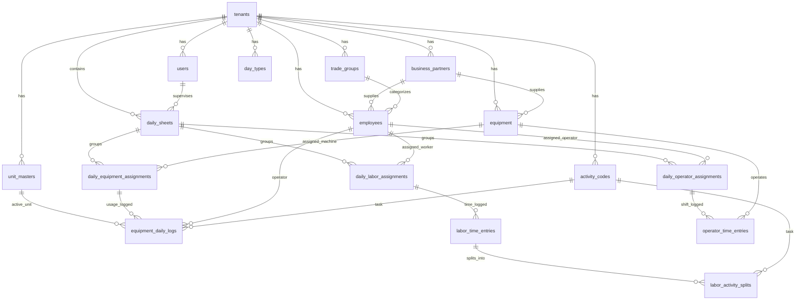

# Mäga Construction - Database & Prisma Schema Design
> **Version:** 2.1 (Enterprise Production & Backward-Compatible)  
> **Date:** 2026-09-22  
> **Database:** PostgreSQL (via Prisma ORM)  
> **Status:** 100% Aligned with existing Backend Controllers AND Frontend Supervisor Mobile App!

---

## 1. Design Principles (Backward Compatibility Guaranteed)

1. **Existing Backend Controllers Protected**:
   - `Employee`: Retains `nicNo`, `employeeCode`, `dailyRate`, `epfNo`, and `tradeGroup` (string) so existing employee queries never break.
   - `TradeGroup` Model & FK Added: Added `TradeGroup` table and `tradeGroupId` foreign key for normalized trade rates, while keeping the legacy `tradeGroup` string field for backward compatibility.
   - `Equipment`: Retains `code`, `name`, `type`, `status` (no renaming to `machineCode`!).
   - `ActivityCode`: Retains `code`, `description` (no renaming to `name`!).
   - `DayType` & `CalendarDay`: Preserved 100% intact for `reportController.ts` holiday/overtime rate calculations.
2. **New Supervisor Mobile App Features Enabled**:
   - `EquipmentDailyLog`: Full dynamic unit support (`Days`, `Hrs`, `EX.hrs`, `mth`, `m2`), meter tracking, idle/breakdown hours, fuel, operator mapping, and activity code mapping.
   - `DailySheet`: Master daily sheet header for the **Submit & Lock Day** supervisor flow.
   - `LaborActivitySplit`: Worker multi-activity hour breakdown.
   - `isStandby`: Standby pool worker assignment flag on `DailyLaborAssignment`.
   - `recordedById`: Direct audit link on time entries and equipment logs to know which supervisor entered each record.

---

## 2. Updated Entity Relationship Diagram



---

## 3. Production Prisma Schema (`schema.prisma`)

```prisma
// =============================================================================
// PRISMA SCHEMA - MÄGA LABOUR & SUPERVISOR OPERATIONS
// Enterprise Multi-Tenant Construction ERP
// =============================================================================

generator client {
  provider = "prisma-client-js"
}

datasource db {
  provider = "postgresql"
  url      = env("DATABASE_URL")
}

// ─────────────────────────────────────────────────────────────────────────────
// 1. TENANTS & USERS
// ─────────────────────────────────────────────────────────────────────────────

model Tenant {
  id           String   @id @default(uuid())
  companyName  String   @map("company_name")
  subdomain    String   @unique
  addressLine1 String?  @map("address_line1")
  addressLine2 String?  @map("address_line2")
  phone        String?
  fax          String?
  email        String?
  status       String   @default("active") // "active" | "suspended"
  createdAt    DateTime @default(now()) @map("created_at")

  // Relations
  users                     User[]
  businessPartners          BusinessPartner[]
  tradeGroups               TradeGroup[]
  unitMasters               UnitMaster[]
  activityCodes             ActivityCode[]
  dayTypes                  DayType[]
  calendarDays              CalendarDay[]
  employees                 Employee[]
  equipment                 Equipment[]
  assignments               DailyAssignment[]
  timeEntries               TimeEntry[]
  dailySheets               DailySheet[]
  dailyOperatorAssignments  DailyOperatorAssignment[]
  dailyEquipmentAssignments DailyEquipmentAssignment[]

  @@map("tenants")
}

model User {
  id                 String   @id @default(uuid())
  tenantId           String   @map("tenant_id")
  username           String
  passwordHash       String   @map("password_hash")
  fullName           String   @map("full_name")
  role               String   // "admin" | "supervisor" | "super_admin"
  employeeId         String?  @map("employee_id")
  mustChangePassword Boolean  @default(true) @map("must_change_password")
  phone              String?
  status             String   @default("active")
  createdAt          DateTime @default(now()) @map("created_at")

  tenant                    Tenant                     @relation(fields: [tenantId], references: [id], onDelete: Cascade)
  dailySheets               DailySheet[]
  dailyLaborAssignments     DailyLaborAssignment[]
  dailyOperatorAssignments  DailyOperatorAssignment[]
  dailyEquipmentAssignments DailyEquipmentAssignment[]
  laborTimeEntriesRecorded  LaborTimeEntry[]           @relation("LaborRecordedBy")
  equipmentLogsRecorded     EquipmentDailyLog[]        @relation("EquipmentRecordedBy")

  @@unique([tenantId, username])
  @@index([tenantId])
  @@map("users")
}

// ─────────────────────────────────────────────────────────────────────────────
// 2. MASTER DATA
// ─────────────────────────────────────────────────────────────────────────────

model BusinessPartner {
  id            String   @id @default(uuid())
  tenantId      String   @map("tenant_id")
  code          String   // e.g. "BP1004093"
  name          String   // e.g. "Aruna Builders (Pvt) Ltd"
  type          String   @default("subcontractor") // "internal" | "subcontractor" | "supplier"
  contactPerson String?  @map("contact_person")
  phone         String?
  email         String?
  address       String?
  status        String   @default("active")
  createdAt     DateTime @default(now()) @map("created_at")

  tenant    Tenant      @relation(fields: [tenantId], references: [id], onDelete: Cascade)
  employees Employee[]
  equipment Equipment[]

  @@unique([tenantId, code])
  @@index([tenantId])
  @@map("business_partners")
}

model TradeGroup {
  id                String   @id @default(uuid())
  tenantId          String   @map("tenant_id")
  code              String   // e.g. "TRD-MAS", "TRD-CARP", "TRD-OP"
  name              String   // "Mason", "Carpenter", "Operator", "General Helper"
  standardDailyRate Decimal  @default(1400.00) @map("standard_daily_rate") @db.Decimal(10, 2)
  standardOtRate    Decimal? @map("standard_ot_rate") @db.Decimal(10, 2)
  createdAt         DateTime @default(now()) @map("created_at")

  tenant    Tenant     @relation(fields: [tenantId], references: [id], onDelete: Cascade)
  employees Employee[]

  @@unique([tenantId, code])
  @@index([tenantId])
  @@map("trade_groups")
}

model UnitMaster {
  id          String   @id @default(uuid())
  tenantId    String   @map("tenant_id")
  code        String   // "Days", "Hrs", "EX.hrs", "mth", "m2", "LTR"
  name        String   // "Days", "Hours", "Extra Hours", "Meter Hours", "Square Meters", "Liters"
  category    String   @default("meter") // "time" | "distance" | "volume" | "area"
  createdAt   DateTime @default(now()) @map("created_at")

  tenant             Tenant              @relation(fields: [tenantId], references: [id], onDelete: Cascade)
  equipmentMeterUnit Equipment[]         @relation("EquipmentMeterUnit")
  equipmentDailyLogs EquipmentDailyLog[]

  @@unique([tenantId, code])
  @@index([tenantId])
  @@map("unit_masters")
}

model ActivityCode {
  id          String   @id @default(uuid())
  tenantId    String   @map("tenant_id")
  code        String   // e.g. "ACT-101", "00-00-11-11-M"
  description String?  // e.g. "Concrete Pouring (Slab & Columns)"
  trade       String?  // e.g. "Masonry"
  category    String?  // e.g. "Civil" | "Structural" | "Finishing"
  createdAt   DateTime @default(now()) @map("created_at")

  tenant             Tenant               @relation(fields: [tenantId], references: [id], onDelete: Cascade)
  activitySplits     LaborActivitySplit[]
  equipmentDailyLogs EquipmentDailyLog[]

  @@unique([tenantId, code])
  @@index([tenantId])
  @@map("activity_codes")
}

model DayType {
  id             String   @id @default(uuid())
  tenantId       String   @map("tenant_id")
  name           String   // Normal Day, Saturday, Sunday, Poya, Public Holiday
  rateMultiplier Decimal  @default(1.00) @map("rate_multiplier") @db.Decimal(3, 2)
  createdAt      DateTime @default(now()) @map("created_at")

  tenant       Tenant        @relation(fields: [tenantId], references: [id], onDelete: Cascade)
  calendarDays CalendarDay[]

  @@unique([tenantId, name])
  @@index([tenantId])
  @@map("day_types")
}

model CalendarDay {
  tenantId  String   @map("tenant_id")
  date      DateTime @db.Date
  dayTypeId String   @map("day_type_id")
  remarks   String?

  tenant  Tenant  @relation(fields: [tenantId], references: [id], onDelete: Cascade)
  dayType DayType @relation(fields: [dayTypeId], references: [id])

  @@id([tenantId, date])
  @@map("calendar")
}

model Employee {
  id                String   @id @default(uuid())
  tenantId          String   @map("tenant_id")
  employeeCode      String?  @map("employee_code") // e.g. "HK030", "HI101"
  callingName       String   @map("calling_name")
  fullName          String?  @map("full_name")
  tradeGroup        String?  @map("trade_group") // Legacy string preserved for existing query safety
  tradeGroupId      String?  @map("trade_group_id") // Foreign key to normalized TradeGroup
  nicNo             String?  @map("nic_no")
  dailyRate         Decimal  @default(1400.00) @map("daily_rate") @db.Decimal(10, 2)
  epfNo             String?  @map("epf_no")
  isOperator        Boolean  @default(false) @map("is_operator")
  licenseNo         String?  @map("license_no")
  status            String   @default("active")
  createdAt         DateTime @default(now()) @map("created_at")
  businessPartnerId String?  @map("business_partner_id")

  tenant              Tenant                    @relation(fields: [tenantId], references: [id], onDelete: Cascade)
  businessPartner     BusinessPartner?          @relation(fields: [businessPartnerId], references: [id])
  tradeGroupRel       TradeGroup?               @relation(fields: [tradeGroupId], references: [id])
  laborAssignments    DailyLaborAssignment[]
  operatorAssignments DailyOperatorAssignment[]
  equipmentLogsDriven EquipmentDailyLog[]

  @@unique([tenantId, employeeCode])
  @@index([tenantId])
  @@map("employees")
}

model Equipment {
  id             String   @id @default(uuid())
  tenantId       String   @map("tenant_id")
  code           String?  // e.g. "EX-04", "TC-01" (Preserved as `code` for controller compatibility)
  name           String   // e.g. "CAT 320D Excavator"
  type           String?  // e.g. "Heavy Earthmover"
  status         String   @default("active")
  meterUnitId    String?  @map("meter_unit_id")
  ownerPartnerId String?  @map("owner_partner_id")
  createdAt      DateTime @default(now()) @map("created_at")

  tenant              Tenant                     @relation(fields: [tenantId], references: [id], onDelete: Cascade)
  meterUnit           UnitMaster?                @relation("EquipmentMeterUnit", fields: [meterUnitId], references: [id])
  ownerPartner        BusinessPartner?           @relation(fields: [ownerPartnerId], references: [id])
  dailyAssignments    DailyEquipmentAssignment[]
  operatorTimeEntries OperatorTimeEntry[]

  @@unique([tenantId, code])
  @@index([tenantId])
  @@map("equipment")
}

// ─────────────────────────────────────────────────────────────────────────────
// 3. DAILY SUPERVISOR MASTER SHEET & LOCK
// ─────────────────────────────────────────────────────────────────────────────

model DailySheet {
  id           String    @id @default(uuid())
  tenantId     String    @map("tenant_id")
  date         DateTime  @db.Date
  supervisorId String    @map("supervisor_id")
  siteCode     String?   @map("site_code") // e.g. "CPC-PKG-02"
  status       String    @default("draft") // "draft" | "submitted" | "approved" | "rejected"
  isLocked     Boolean   @default(false) @map("is_locked")
  submittedAt  DateTime? @map("submitted_at")
  approvedAt   DateTime? @map("approved_at")
  approvedById String?   @map("approved_by_id")
  remarks      String?
  createdAt    DateTime  @default(now()) @map("created_at")
  updatedAt    DateTime  @updatedAt @map("updated_at")

  tenant               Tenant                     @relation(fields: [tenantId], references: [id], onDelete: Cascade)
  supervisor           User                       @relation(fields: [supervisorId], references: [id])
  laborAssignments     DailyLaborAssignment[]
  operatorAssignments  DailyOperatorAssignment[]
  equipmentAssignments DailyEquipmentAssignment[]

  @@unique([tenantId, supervisorId, date])
  @@index([tenantId, date])
  @@map("daily_sheets")
}

// ─────────────────────────────────────────────────────────────────────────────
// 4. DAILY ASSIGNMENTS & TRANSACTIONS
// ─────────────────────────────────────────────────────────────────────────────

model DailyLaborAssignment {
  id           String   @id @default(uuid())
  tenantId     String   @map("tenant_id")
  dailySheetId String?  @map("daily_sheet_id")
  date         DateTime @db.Date
  supervisorId String   @map("supervisor_id")
  employeeId   String   @map("employee_id")
  isStandby    Boolean  @default(false) @map("is_standby") // True if added from site standby pool
  createdAt    DateTime @default(now()) @map("created_at")

  tenant     Tenant          @relation(fields: [tenantId], references: [id], onDelete: Cascade)
  dailySheet DailySheet?     @relation(fields: [dailySheetId], references: [id], onDelete: Cascade)
  supervisor User            @relation(fields: [supervisorId], references: [id])
  employee   Employee        @relation(fields: [employeeId], references: [id])
  timeEntry  LaborTimeEntry?

  @@unique([tenantId, date, employeeId])
  @@index([tenantId, date, supervisorId])
  @@map("daily_labor_assignments")
}

model LaborTimeEntry {
  id           String   @id @default(uuid())
  assignmentId String   @unique @map("assignment_id")
  inTime       String?  @map("in_time") // "07:30"
  outTime      String?  @map("out_time") // "17:00"
  shiftHours   Decimal  @default(0.00) @map("shift_hours") @db.Decimal(5, 2)
  otHours      Decimal  @default(0.00) @map("ot_hours") @db.Decimal(5, 2)
  recordedById String?  @map("recorded_by_id") // Audit trail to supervisor
  status       String   @default("draft") // "draft" | "pending" | "done"
  remarks      String?
  createdAt    DateTime @default(now()) @map("created_at")
  updatedAt    DateTime @updatedAt @map("updated_at")

  assignment     DailyLaborAssignment @relation(fields: [assignmentId], references: [id], onDelete: Cascade)
  recordedBy     User?                @relation("LaborRecordedBy", fields: [recordedById], references: [id])
  activitySplits LaborActivitySplit[]

  @@map("labor_time_entries")
}

model LaborActivitySplit {
  id             String   @id @default(uuid())
  tenantId       String   @map("tenant_id")
  timeEntryId    String   @map("time_entry_id")
  activityCodeId String   @map("activity_code_id")
  hours          Decimal  @default(0.00) @db.Decimal(5, 2)
  createdAt      DateTime @default(now()) @map("created_at")

  tenant       Tenant       @relation(fields: [tenantId], references: [id], onDelete: Cascade)
  timeEntry    TimeEntry    @relation(fields: [timeEntryId], references: [id], onDelete: Cascade)
  activityCode ActivityCode @relation(fields: [activityCodeId], references: [id])

  @@index([tenantId])
  @@index([timeEntryId])
  @@map("labor_activity_splits")
}

// ─────────────────────────────────────────────────────────────────────────────
// 14. OPERATOR ASSIGNMENTS & TIME ENTRIES
// ─────────────────────────────────────────────────────────────────────────────
model DailyOperatorAssignment {
  id           String   @id @default(uuid())
  tenantId     String   @map("tenant_id")
  dailySheetId String?  @map("daily_sheet_id")
  date         DateTime @db.Date
  supervisorId String   @map("supervisor_id")
  operatorId   String   @map("operator_id")
  createdAt    DateTime @default(now()) @map("created_at")

  tenant     Tenant             @relation(fields: [tenantId], references: [id], onDelete: Cascade)
  dailySheet DailySheet?        @relation(fields: [dailySheetId], references: [id], onDelete: Cascade)
  supervisor User               @relation(fields: [supervisorId], references: [id])
  operator   Employee           @relation(fields: [operatorId], references: [id])
  timeEntry  OperatorTimeEntry?

  @@unique([tenantId, date, operatorId])
  @@index([tenantId, date, supervisorId])
  @@map("daily_operator_assignments")
}

model OperatorTimeEntry {
  id                  String     @id @default(uuid())
  tenantId            String     @map("tenant_id")
  assignmentId        String     @unique @map("assignment_id")
  inTime              String?    @map("in_time") // "07:00"
  outTime             String?    @map("out_time") // "17:30"
  shiftHours          Decimal    @default(0.00) @map("shift_hours") @db.Decimal(5, 2)
  otHours             Decimal    @default(0.00) @map("ot_hours") @db.Decimal(5, 2)
  assignedEquipmentId String?    @map("assigned_equipment_id")
  safetyPassed        Boolean    @default(true) @map("safety_passed")
  notes               String?
  status              String     @default("draft") // "draft" | "pending" | "done"
  createdAt           DateTime   @default(now()) @map("created_at")
  updatedAt           DateTime   @updatedAt @map("updated_at")

  tenant            Tenant                  @relation(fields: [tenantId], references: [id], onDelete: Cascade)
  assignment        DailyOperatorAssignment @relation(fields: [assignmentId], references: [id], onDelete: Cascade)
  assignedEquipment Equipment?              @relation(fields: [assignedEquipmentId], references: [id])

  @@index([tenantId])
  @@map("operator_time_entries")
}

// ─────────────────────────────────────────────────────────────────────────────
// 15. EQUIPMENT ASSIGNMENTS & DAILY LOGS (Dynamic Units & Meter Engine)
// ─────────────────────────────────────────────────────────────────────────────
model DailyEquipmentAssignment {
  id           String   @id @default(uuid())
  tenantId     String   @map("tenant_id")
  dailySheetId String?  @map("daily_sheet_id")
  date         DateTime @db.Date
  supervisorId String   @map("supervisor_id")
  equipmentId  String   @map("equipment_id")
  createdAt    DateTime @default(now()) @map("created_at")

  tenant     Tenant             @relation(fields: [tenantId], references: [id], onDelete: Cascade)
  dailySheet DailySheet?        @relation(fields: [dailySheetId], references: [id], onDelete: Cascade)
  supervisor User               @relation(fields: [supervisorId], references: [id])
  equipment  Equipment          @relation(fields: [equipmentId], references: [id])
  dailyLog   EquipmentDailyLog?

  @@unique([tenantId, date, equipmentId])
  @@index([tenantId, date, supervisorId])
  @@map("daily_equipment_assignments")
}

model EquipmentDailyLog {
  id              String   @id @default(uuid())
  tenantId        String   @map("tenant_id")
  assignmentId    String   @unique @map("assignment_id")
  
  // Dynamic Units (Days, Hrs, EX.hrs, mth, m2)
  activeUnitId    String?  @map("active_unit_id")
  loggedQuantity  Decimal  @default(0.00) @map("logged_quantity") @db.Decimal(10, 2)
  
  // Meter & Running Hours
  initialMeter    Decimal  @default(0.00) @map("initial_meter") @db.Decimal(10, 2)
  finalMeter      Decimal  @default(0.00) @map("final_meter") @db.Decimal(10, 2)
  netRunningHours Decimal  @default(0.00) @map("net_running_hours") @db.Decimal(6, 2)
  
  // Operational Time Distribution
  workingHours    Decimal  @default(0.00) @map("working_hours") @db.Decimal(6, 2)
  idleHours       Decimal  @default(0.00) @map("idle_hours") @db.Decimal(6, 2)
  breakdownHours  Decimal  @default(0.00) @map("breakdown_hours") @db.Decimal(6, 2)
  
  // Fuel Consumed
  fuelLiters      Decimal  @default(0.00) @map("fuel_liters") @db.Decimal(8, 2)
  
  // Mappings
  operatorId      String?  @map("operator_id")
  activityCodeId  String?  @map("activity_code_id")
  recordedById    String?  @map("recorded_by_id") // Audit link to supervisor
  remarks         String?
  status          String   @default("draft") // "draft" | "pending" | "done"
  createdAt       DateTime @default(now()) @map("created_at")
  updatedAt       DateTime @updatedAt @map("updated_at")

  tenant       Tenant                   @relation(fields: [tenantId], references: [id], onDelete: Cascade)
  assignment   DailyEquipmentAssignment @relation(fields: [assignmentId], references: [id], onDelete: Cascade)
  activeUnit   UnitMaster?              @relation(fields: [activeUnitId], references: [id])
  operator     Employee?                @relation(fields: [operatorId], references: [id])
  activityCode ActivityCode?            @relation(fields: [activityCodeId], references: [id])
  recordedBy   User?                    @relation("EquipmentRecordedBy", fields: [recordedById], references: [id])

  @@index([tenantId])
  @@map("equipment_daily_logs")
}
```

---

## 4. Field Compatibility Cross-Reference

| Model | Field Name In Schema | Status | Description |
| :--- | :--- | :--- | :--- |
| `Employee` | `tradeGroupId` | 🆕 New FK | Points to normalized `TradeGroup` table |
| `Employee` | `tradeGroup` | ✅ Preserved | Legacy string column preserved for backward compatibility |
| `Employee` | `nicNo` | ✅ Preserved | Original NIC field name (matches existing controllers) |
| `Employee` | `epfNo` | ✅ Preserved | Original EPF field name |
| `Employee` | `isOperator`, `licenseNo` | 🆕 Added | Operator designation and license fields |
| `Equipment` | `code` | ✅ Preserved | Original equipment code field (matches controllers) |
| `ActivityCode` | `description` | ✅ Preserved | Original description field (matches controllers) |
| `DayType` / `CalendarDay` | Entire Models | ✅ Preserved | Overtime and holiday calculation engine |
| `DailySheet` | Entire Model | 🆕 Added | Handles Day Submit & Lock |
| `EquipmentDailyLog` | Entire Model | 🆕 Added | Handles multi-unit machinery logs |
| `LaborActivitySplit` | Entire Model | 🆕 Added | Handles worker task split hours |
